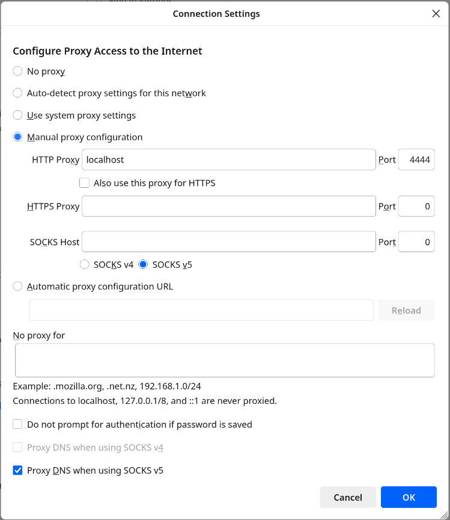

Anonymous websites
==================

## Browse anonymous websites

### Manual configuration

To browse anonymous websites inside Invisible Internet, configure your web browser to use HTTP proxy 127.0.0.1:4444 (available by default in i2pd).

In Firefox: Settings -> General -> Network Settings -> Configure Proxy Access to the Internet -> choose Manual proxy configuration, enter HTTP Proxy 127.0.0.1, Port 4444:

It's recommended to use an HTTP proxy when browsing, as i2pd filters certain HTTP request headers.

In Chromium: run chromium executable with key

    chromium --proxy-server="http://127.0.0.1:4444"

Note that if you wish to stay anonymous, you’ll also need to tune your browser for better privacy. **Do your own research**.

### Easiest option: I2PD Browser

If you don't want to manually configure a browser, you can use **[I2PD Browser](https://github.com/PurpleI2P/i2pdbrowser)**, an official bundle that downloads a recent Firefox ESR, pre-configures it to work with i2pd, and makes browsing the Invisible Internet much simpler.

Follow the platform-specific instructions in the repository.

Even with I2PD Browser, it's still recommended to **do your own research** on additional privacy hardening if you want maximum anonymity.

Big list of Invisible Internet websites (eepsites) can be found at [identiguy.i2p](http://identiguy.i2p).

## Host anonymous website

If you wish to run your own website in Invisible Internet, follow those steps:

1) Run your webserver and find out which host:port it uses (for example, 127.0.0.1:8080).

2) Configure i2pd to create HTTP server tunnel. Put in your ~/.i2pd/tunnels.conf file:

    [anon-website]
    type = http
    host = 127.0.0.1
    port = 8080
    keys = anon-website.dat

3) Restart i2pd or send SIGHUP signal.

4) Find b32 destination of your website.

   Go to webconsole -> [I2P tunnels page](http://127.0.0.1:7070/?page=i2p_tunnels). Look for Server tunnels and you will see address like \<long random string\>.b32.i2p next to anon-website.

   Website is now available in Invisible Internet by visiting this address.

5) (Optional) Register short and memorable .i2p domain on [reg.i2p](http://reg.i2p), you can use `regaddr` from [i2pd-tools](https://github.com/PurpleI2P/i2pd-tools) to generate authentication string.
