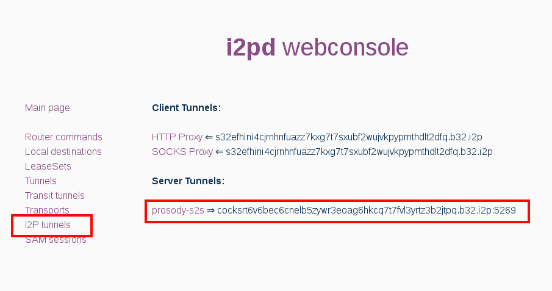
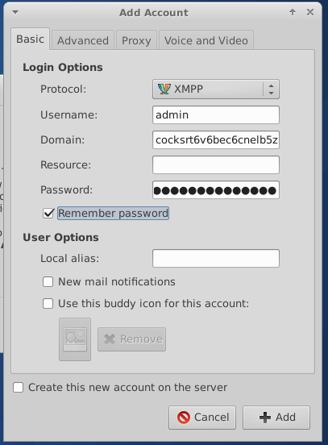
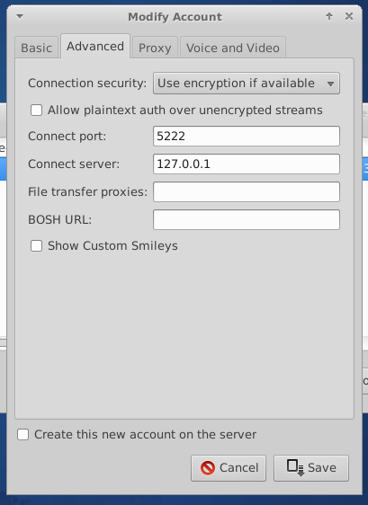
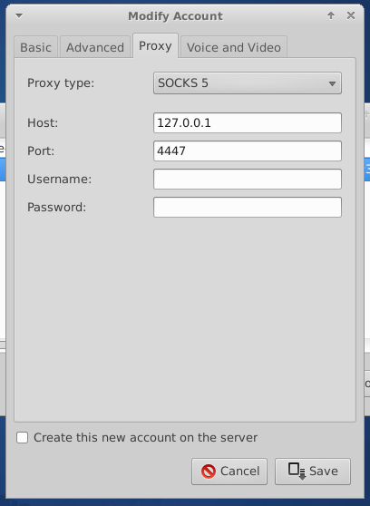

Decentralized instant messaging
===============================

> Extensible Messaging and Presence Protocol (XMPP) is an open XML technology for real-time communication, which powers a wide range of applications including instant messaging, presence and collaboration.

This tutorial shows you how to run your own [XMPP](https://xmpp.org/about/) server inside I2P network. That server can be used for decentralized instant messaging and for building any other applications with XMPP protocol.
 
## Creating server I2P tunnel

Write the following lines in `tunnels.conf` file:

    [prosody-s2s]
    type=server
    host=127.0.0.1
    port=5269
    inport=5269
    keys=prosody.dat

    [prosody-c2s]
    type=server
    host=127.0.0.1
    port=5222
    inport=5222
    keys=prosody.dat

If you plan to use messenger only on a local host, prosody-c2s section may be omitted. Restart i2pd to apply new settings and look at webconsole http://127.0.0.1:7070/ page `I2P tunnels` for a new I2P address:

Save this xxx.b32.i2p address, it will be a domain name of your XMPP server.

## Installing and configuring XMPP server

We will use [prosody](https://prosody.im/) XMPP server, it is the most lightweight and has ready to use module for I2P. Installation instructions are available at [official documentation](https://prosody.im/download/start), in Debian/Ubutntu just run `apt install prosody`.

bit32 library for lua is required for `mod_darknet` module. If your lua version is less than 5.2 (most likely), run `apt install lua-bit32`.

Install [mod_darknet](https://github.com/majestrate/mod_darknet) module. Download [this file](https://raw.githubusercontent.com/majestrate/mod_darknet/master/mod_darknet.lua) to prosody modules directory, usually it is `/usr/lib/prosody/modules`.

Edit config file `/etc/prosody/prosody.cfg.lua`. Replace xxx.b32.i2p with your address:

    interfaces = { "127.0.0.1" };
    admins = { "admin@xxx.b32.i2p" };
    modules_enabled = {
        "roster"; "saslauth"; "tls"; "dialback"; "disco"; "posix"; "private"; "vcard"; "register"; "admin_adhoc"; "darknet"; 
    };
    modules_disabled = {};
    allow_registration = false;
    darknet_only = true;
    c2s_require_encryption = true;
    s2s_secure_auth = false;
    authentication = "internal_plain";

    -- On Debian/Ubuntu
    daemonize = true;
    pidfile = "/var/run/prosody/prosody.pid";
    log = {
        error = "/var/log/prosody/prosody.err";
        "*syslog";
    }
    certificates = "certs";

    VirtualHost "xxx.b32.i2p";
    ssl = {
        key = "/etc/prosody/certs/xxx.b32.i2p.key";
        certificate = "/etc/prosody/certs/xxx.b32.i2p.crt";
    }
 
The last step is certificates generation. Run the following:

    openssl genrsa -out /etc/prosody/certs/xxx.b32.i2p.key 2048
    openssl req -new -x509 -key /etc/prosody/certs/xxx.b32.i2p.key -out /etc/prosody/certs/xxx.b32.i2p.crt -days 3650
    chown root:prosody /etc/prosody/certs/*.b32.i2p.{key,crt}
    chmod 640 /etc/prosody/certs/*.b32.i2p.{key,crt}

Restart prosody to apply new settings.

## Creating accounts and connecting clients

To add admin account, run in your terminal:

    sudo prosodyctl adduser admin@xxx.b32.i2p

Now configure your XMPP client (for example, [Pidgin](https://pidgin.im)). 

If you are connecting to a localhost, specify custom server address 127.0.0.1 port 5222.

If you are connecting to a server remotely via I2P, specify a Socks5 proxy server 127.0.0.1:4447. 

If everything is configured correctly, you will be able add other users of I2P federation to your contacts and chat with them. 

To test your setup, add `hello@xmppoeiqpbeelicgkoim3ibegjonbqwh7vv7d6nsju73tjjmujpq.b32.i2p` to your contacts and send it "hello".

## (Advanced) Clearnet-to-I2P federation

It is also possible to configure your existing "clearnet" XMPP server to join I2P federation and chat with darknet users. For that, create a tunnel as described above. Each user that wishes to communicate with your server will have to add custom mapping to their prosody config file. That is how my server is configured to communicate with `i2p.rocks` server:

    darknet_map = {
        ["i2p.rocks"] = "ynkz7ebfkllljitiodcq52pa7fgqziomz4wa7tv4qiqldghpx4uq.b32.i2p";
        ["muc.i2p.rocks"] = "ynkz7ebfkllljitiodcq52pa7fgqziomz4wa7tv4qiqldghpx4uq.b32.i2p";
    }
 
If you have any questions, you may ask them at our XMPP conference `federation@muc.i2p.rocks`. Happy chatting! 
